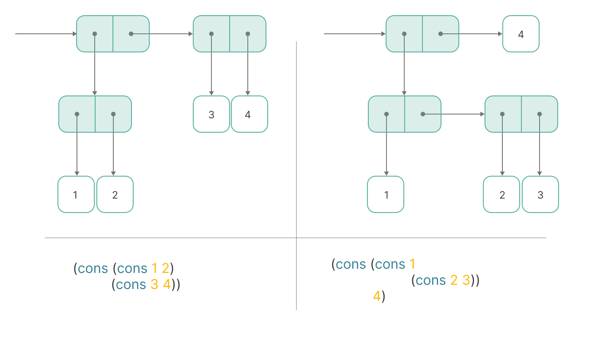

# pair-constructor

[](https://badge.fury.io/js/pair-constructor)
[](https://github.com/hnatiukr/pair-constructor/actions/workflows/node.js.yml)
[](https://opensource.org/licenses/MIT)

A **pair**, as a compound data constructor for constructed abstractions. TypeScript supported.

<p align="center">
  
</p>

## Installation

```shell
npm i pair-constructor
```

```shell
yarn add pair-constructor
```

## Usage

See [documentation](https://github.com/hnatiukr/pair-constructor/blob/main/docs/README.md) and [examples](https://github.com/hnatiukr/pair-constructor/blob/main/docs/EXAMPLES.md).

## Motivation

One of the most critical topics in programming is abstraction. The larger the codebase, the more abstractions are used or created. A significant part of the developer's time is spent modelling the domain and implementing it in code, as well as in its further support and development. As a rule, this issue is not given time at all, but the quality of your code depends on the ability to model, and how easy it will be to work with it and understand and modify it.

The idea of data abstraction is to define for each type of data object a set of basic operations through which all actions with objects of this type will be expressed:

- it is easier for us to talk about the program because, at the level of abstraction at which we work, we operate with a small limited set of entities, which also correspond to the same level of thinking about them
- it is easier for us to combine different parts of the program, glueing them together through the interfaces we have defined to obtain new more complex behaviour
- it is much easier for us to maintain and change our programs, because the code, separated by an abstraction barrier at a certain level, does not depend on implementing lower levels. This allows individual levels to be overwritten at any time, for example for better performance.

A pair is a data structure that is the basis of compound data. Pairs don't exist in JavaScript/TypeScript. The idea is that the constructor creates a pair, and the selectors serve to extract the first value (using `car`) and the second value (using `cdr`) from the pair. Pairs are immutable. You can only create a new one based on the previous one.

A pair is only what is created using the cons constructor. If for some reason, not a pair was passed to the selectors, then the result will be just such an error: `Argument must be a pair, but it was ${ARG}`.

--

_[CAR and CDR etymology](https://en.wikipedia.org/wiki/CAR_and_CDR)_
