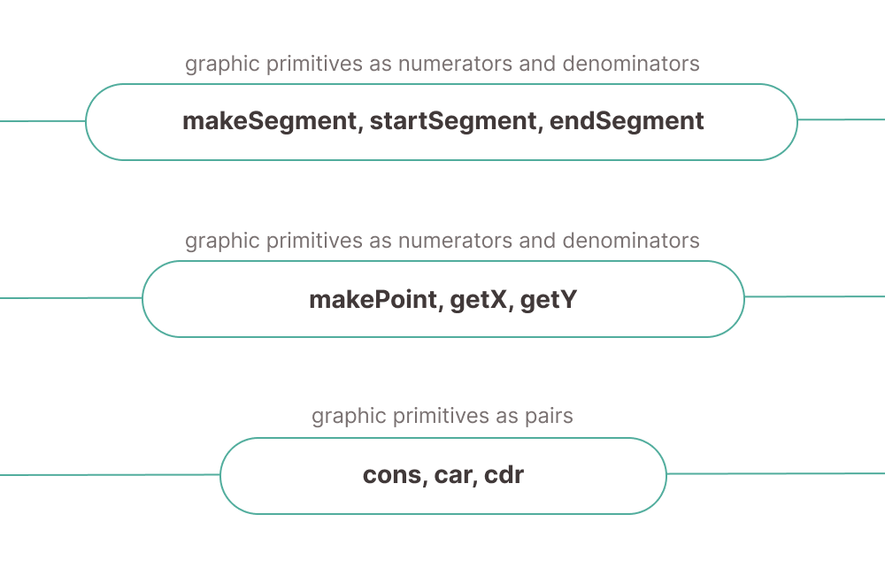

## Example of building abstraction levels based on pairs

> The correct way to build a data structure is to follow the principle of one level of abstraction. This means that when working in one subject area on a certain slice, one should operate with objects of this slice only, avoiding objects that do not belong to it.

<p align="center">
  
</p>

### **1-st level: lower abstraction (Pairs)**

```javascript
const pair = cons('first', 'second');

car(pair); // => "first"
cdr(pair); // => "second"
isPair(pair); // true
toString(pair); // => "(first, second)"
```

### **2-nd level: higher abstraction (Coordinates of a Point)**

```javascript
const makePoint = (a, b) => cons(a, b);
const getX = (point) => car(point);
const getY = (point) => cdr(point);

const getQuadrant = (point) => {
  const x = getX(point);
  const y = getY(point);

  switch (true) {
    case x > 0 && y > 0:
      return 1;
    case x < 0 && y > 0:
      return 2;
    case x < 0 && y < 0:
      return 3;
    case x > 0 && y < 0:
      return 4;
    default:
      return null;
  }
};

const getSymmetricalPoint = (point) => {
  const x = getX(point);
  const y = getY(point);

  return makePoint(-x, -y);
};

const calculateDistance = (point1, point2) => {
  const [x1, y1] = [getX(point1), getY(point1)];
  const [x2, y2] = [getX(point2), getY(point2)];

  return Math.sqrt((x2 - x1) ** 2 + (y2 - y1) ** 2);
};

// ***

const point1 = makePoint(3, 4);
const point2 = makePoint(0, 0);

getX(point1); // => 3
getY(point2); // => 0
getQuadrant(point1); // 1
distance(point1, point2); // 5
getSymmetricalPoint(makePoint(1, 5)); // makePoint(-1, -5)
calculateDistance(makePoint(-2, -3), makePoint(-4, 4)); // ≈ 7.28
```

### **3-rd level: highest abstraction (Line Segments and an Objects)**

```javascript
const makeSegment = (point1, point2) => cons(point1, point2);

const startSegment = (segment) => car(segment);

const endSegment = (segment) => cdr(segment);

const segmentToString = (segment) => {
  const startToString = pointToString(startSegment(segment));
  const endToString = pointToString(endSegment(segment));

  return `[${startToString}, ${endToString}]`;
};

const midpointSegment = (point) => {
  const start = startSegment(point);
  const end = endSegment(point);

  const [x1, y1] = [getX(start), getY(start)];
  const [x2, y2] = [getX(end), getY(end)];

  const middleX = (x1 + x2) / 2;
  const middleY = (y1 + y2) / 2;

  return makePoint(middleX, middleY);
};

// ***

const segment = makeSegment(makePoint(1, 2), makePoint(-4, -2));
const point1 = startSegment(segment);
const point2 = endSegment(segment);

segmentToString(segment); // [(1, 2), (-4, -2)]
pointToString(point1); // (1, 2)
pointToString(point2); // (-4, -2)
pointToString(startSegment(segment)) === pointToString(makePoint(1, 2)); // true
pointToString(midpointSegment(segment)); // (-1.5, 0)
```

## Other examples

**Rational numbers** as pairs of values: numerator and denominator

```javascript
const make = (numer, denom) => cons(numer, denom);

const numer = (rat) => car(rat);

const denom = (rat) => cdr(rat);

const toString = (rat) => `${numer(rat)} / ${denom(rat)}`;

const isEqual = (rat1, rat2) => numer(rat1) * denom(rat2) === denom(rat1) * numer(rat2);

const add = (rat1, rat2) => {
  const [a, b] = [numer(rat1), denom(rat1)];
  const [c, d] = [numer(rat2), denom(rat2)];

  return make(a * d + b * c, b * d); // (a * d + b * c) / (b * d)
};

const sub = (rat1, rat2) => {
  const [a, b] = [numer(rat1), denom(rat1)];
  const [c, d] = [numer(rat2), denom(rat2)];

  return make(a * d - b * c, b * d); // (a * d - b * c) / (b * d)
};

const mul = (rat1, rat2) => {
  const [a, b] = [numer(rat1), denom(rat1)];
  const [c, d] = [numer(rat2), denom(rat2)];

  return make(a * c, b * d); // (a * c) / (b * d)
};

const div = (rat1, rat2) => {
  const [a, b] = [numer(rat1), denom(rat1)];
  const [c, d] = [numer(rat2), denom(rat2)];

  return make(a * d, b * c); // (a * d) / (b * c)
};

// ***

const rat1 = make(2, 3);
const rat2 = make(4, 6);
const rat3 = make(7, 2);

toString(rat2); // '4 / 6'
isEqual(rat1, rat2); // true

add(rat1, rat3); // 25/6
sub(rat3, rat1); // 17/6
mul(rat1, rat3); // 14/6
div(rat1, rat3); // 4/21
```
